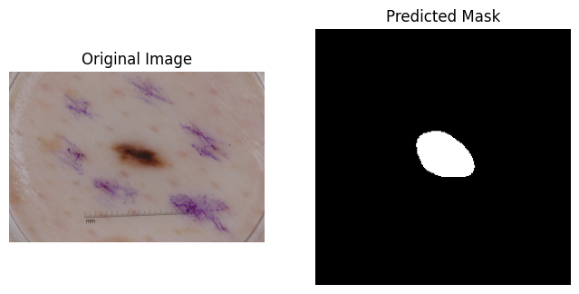
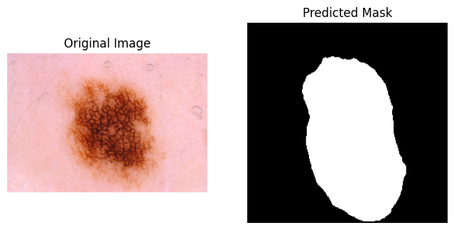
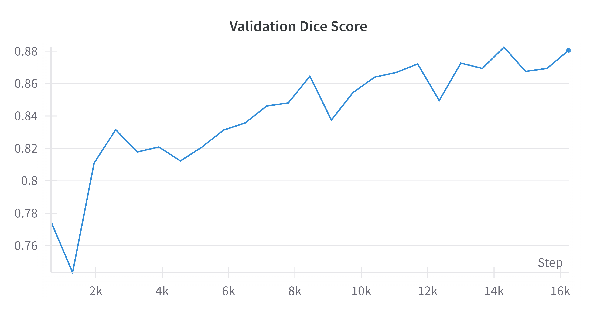
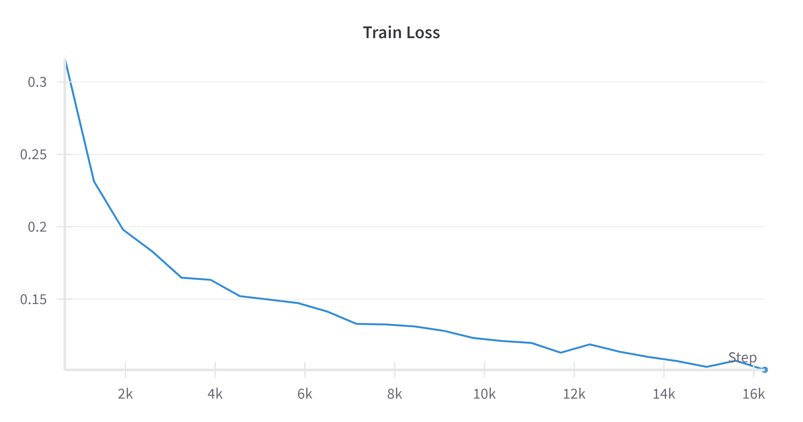

# U-Net Implementation for Medical Image Segmentation

## Table of Contents
1. [Introduction](#1-introduction)
2. [Project Overview](#2-project-overview)
3. [Model Architecture](#3-model-architecture)
4. [Dataset](#4-dataset)
5. [Installation](#5-installation)
6. [Training & Evaluation](#6-training--evaluation)
7. [Results](#7-results)
8. [Validation and Loss](#8-validation-and-loss)
9. [Directory Structure](#9-directory-structure)
10. [References](#10-references)

## 1. Introduction
U-Net is a convolutional neural network (CNN) architecture designed for image segmentation tasks. It is widely used in applications such as medical image analysis and satellite image processing. This project implements U-Net for **Medical Image Segmentation** using **PyTorch**.

## 2. Project Overview
This project aims to develop a deep learning model based on the U-Net architecture for **Medical Image Segmentation**. The model is trained on **ISIC** and evaluated using Dice Coefficient metrics.

## 3. Model Architecture
**U-Net** consists of an encoder-decoder structure with skip connections:
- **Encoder**: Feature extraction using convolutional layers
- **Bottleneck**: Bridge between encoder and decoder
- **Decoder**: Upsampling and reconstruction of segmented images
- **Skip Connections**: Help retain spatial information


## 4. Dataset
- **Dataset Name**: [**Dataset**](https://challenge.isic-archive.com/data/#2018)
- **Number of Images And Masks**: 16072
- **Classes**: 2
- **Preprocessing**: 
  - Resizing images to [256X256]
  - Normalization

## 5. Installation
Clone the repository and install dependencies:
```bash
git clone https://github.com/devs-mohanraj/U-Net-.git
cd U-Net-
pip install -r requirements.txt
```

## 6. Training & Evaluation
To train the model:
```bash
python train.py 
```
To evaluate the model:

**Use inference.ipynb for visualization**

## 7. Results
Performance metrics:
- **Dice Coefficient**: **88.051%**

Example segmentation results:

**The segmentation of the Melanocytic lesion**


**The Segmentation of the Final_Stage Melanoma**


## 8. Validation and Loss
**The validation dice score**


**The training Loss**


## 9. Directory Structure
```
unet_medical_segmentation/
│── data/                   # Dataset folder
│   ├── images/             # Raw medical images
│   ├── masks/              # Corresponding segmentation masks
│── src/                    # Source code
│   ├── unet.py             # U-Net model implementation
│   ├── dataset.py          # PyTorch Dataset class
│   ├── train.py            # Training script
│   ├── inference.ipynb     # Inference on new images
│   ├── utils.py            # Utility functions (metrics, visualization)
│── outputs/                # Output directory
│   ├── model_weights/      # Saved models
│── requirements.txt        # Required dependencies
│── README.md               # Project documentation
```

## 10. References
- **U-Net Paper**: [Ronneberger et al., 2015](https://arxiv.org/pdf/1505.04597)
